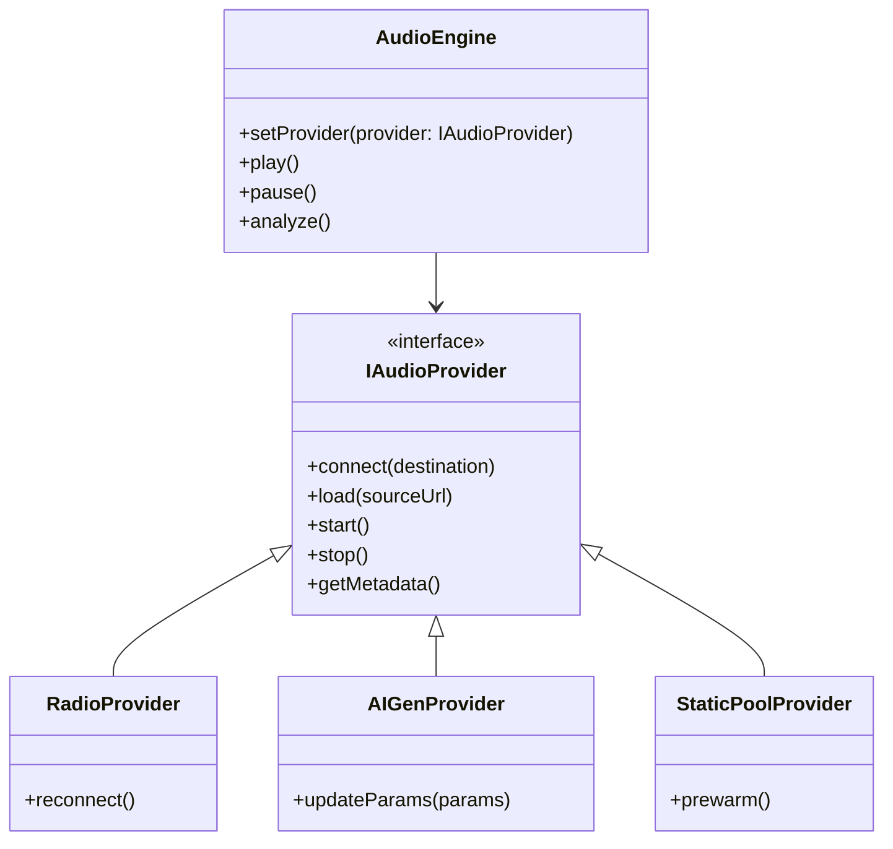

# Sonoria v3.0 架构设计文档

## 1. 统一音频接口设计 (Unified Audio Interface)

为了支持多种音频来源，引入 `AudioProvider` 抽象接口。

### 1.1 类图 (Mermaid 概念)


### 1.2 接口定义 (TypeScript 伪代码)
```typescript
interface IAudioProvider {
  id: string;
  type: 'stream' | 'generative' | 'static';
  context: AudioContext;

  connect(node: AudioNode): void;
  load(id: string): Promise<void>;
  play(): void;
  pause(): void;
  stop(): void;

  // 实时元数据获取
  getMetadata(): { title: string; artist: string; [key: string]: any };
}
```

## 2. 可视化集成方案

### 2.1 数据流向
1. **Audio Engine** 提供音频流。
2. **Meyda.js** 挂载到音频节点，提取 `spectralCentroid` 和 `rms`。
3. **Visualizer** 接收特征数据，更新 Three.js `ShaderMaterial` 的 `uniforms`。
4. **WebGL Renderer** 执行渲染。

### 2.2 性能降级策略 (Performance Tiers)
- **High (Tier 3)**: 100k+ 粒子, Bloom 后处理, 高阶 Shader 特效。
- **Medium (Tier 2)**: 20k 粒子, 无后处理, 基础物理仿真。
- **Low (Tier 1)**: 5k 粒子, 降级为 Canvas 2D 粒子系统 (v2.1 模式)。

## 3. 迁移路径 (Migration Path)

1. **Phase 1 (兼容期)**: 引入 Tone.js，重构 `AudioEngine` 支持 Provider 模式，保持旧版 UI。
2. **Phase 2 (功能期)**: 依次实现 `RadioProvider` 和 `AIGenProvider` (基于原有 Strudel 逻辑迁移)。
3. **Phase 3 (视觉期)**: 集成 Three.js 基础管线，替换 `visualizer.js` 的渲染内核。
4. **Phase 4 (优化期)**: 完善移动端适配与版权信息注入。

## 4. 集成方案

### 4.1 目录结构调整
- `js/engine/`: 音频引擎与 Providers。
- `js/visuals/`: Three.js 场景与 Shaders。
- `js/core/`: 状态管理与 UI 调度。

### 4.2 零成本起步方案
- 使用 `unpkg.com` 引入依赖，避免构建步骤（符合项目当前纯 HTML/JS 特征）。
- 资源池首批接入 [Incompetech](https://incompetech.com/) 的 CC-BY 资源。
